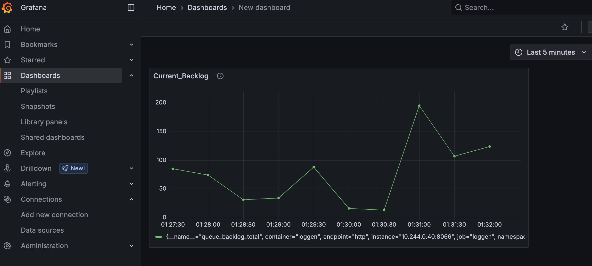

# The K8s DevOps Pipeline: Helm, Helmfile, ArgoCD, and Minikube Demo

- Purpose:
    - Focuses on KEDA challenges (i.e., threshold logic- to avoid frequent scaleup and down with unnessary surges or spikes)
    - A quick infrastructure demo showcasing K8s and Cloud service deployment with industry DevOps CD/CI operations with Docker, GitHub Actions, Helm, Helmfile, and ArgoCD (and will go from minikube to k8s) with docuemtned notes
    

- What It Does:
    - Lints and builds container images (Docker + GitHub Actions) 
        - K8s orchestration 
        - Cloud service deployment (GCP, AWS)
        - Validate builds and pushes 

## Development from scratch (without cloning)

- Core concepts around toolings
    - Autoscaling
        - KEDA; Built-in in K8s
            - uses metrics as event-trigger
            - Recommend: Debug with downstream error log + low trigger amount 
            - need special handling when CI/CD conflicts with autoscaling
    - Provisioning, CI/CD
        - Tools: k8s-> Helm -> Terraform -> ArgoCD

### Minikube 
brew install minikube
### K8s
brew install kubectl   
minikube start --driver=docker

### Going from smaller bits to the tools that orchestrate them k8s > Helm > Helmfile/ ArgoCD
Mindmap: 
k8s > Helm > Helmfile/ ArgoCD
Key idea: 
Everything is declarative, but the cluster has configurable mechanicsm to ensure the "desirable state" is met. Yet, tracking cluster and system health is still on us! 

- K8s Quick Guide:
K8s focuses on defining distributed containerizations, enabling image, container and load balancing at cluster level, and assumes all images have been built, with configuration for extra "customization" is done via configuration (or from image's perspective, driven by container's env var).

- K8s & VMs
    - Idea: 
        - Allow distributed nodes (if not native to desired Arch, run VM) to connect to K8s API server
        - Pass service manifests, k8s metadata to k8s. 
        - Leave node managements to K8s. 

Thus, in a k8s manifest, we have the following catagory: 
- Pod 
    - Smallest units of K8s
    - Holds one or more images
    - (i.e., container level)
- Deployment + ReplicaSet
    - (i.e., replications of pod)
- StatefulSet (Pod ID management)
- Running Jobs 
    - Job, CronJob, DaemonSet 
    - (i.e.,at pod level, purpose is to track if desired state is achieved, if not, define kill or rety logic with the follwoing)

Organizing the K8s Cluster 
- Namespace- [1]
    Kubernetes namespace 
- Configmap are can be mounted like data volumes[4]:
    - Basically apply a configMap pod to accept mounted files 
    - shortcut kubectl create configmap my-config --from-file=config.json
    kubectl create configmap my-config --from-file=config.json -n namespace_tag

1. Apply Helm to enable automation on k8s compose Helm chart orchestrates k8s manifests (i.e., multiple pods specs), enabling image and k8s resources modifications
    - Create k8s work directory with Helm     
    - helm create k8s
    - helm template myapp ./my-chart -f values.yaml > rendered.yaml
    - kubectl apply -f rendered.yaml

2. How-to
    - start with helm gen. dir (1) or a desinated dir with (2)
        - helm install my-app ./my-chart
        - helm install my-app ./my-chart

    -  template to create k8s manifests for declarative assignment (i.e. define desired state of k8s cluster) 
    -  Chart.yaml to keep track on all release-names and chart-names 
    -  values.yaml for k8s resources spec

    helm install myapp ./my-chart -f values.yaml

3. Helmfile- Centralize helm chart for release-name and chart-name (warning: use with caution). One Helm chart may contain tightly coupled pipelines. Yet, loosely coupled pipelines may have specific infra logics such as 
    - ENV Var 
    - dependency 
    ... etc to be coordinated by helm chart release schedule and/ or injected script var on helm chart for orchestration.  

brew install helmfile
helmfile apply

4. ArgoCD [3]- Alternative to Helmfile  but update my cluster with git push helm chart (using ArgoCD Application)
    - To be deployed an image in K8s cluster and is given a repo to watch for changes 
    -  Create argocd namespace[3] 

kubectl create namespace argocd
kubectl apply -n argocd -f https://raw.githubusercontent.com/argoproj/argo-cd/stable/manifests/install.yaml

kubectl get secret argocd-initial-admin-secret -n argocd -o jsonpath="{.data.password}" | base64 -d

UI
kubectl port-forward svc/argocd-server -n argocd 8080:443

2. Prometheus

helm repo add prometheus-community https://prometheus-community.github.io/helm-charts
helm repo update
helm install prometheus prometheus-community/prometheus

## Reference

 [1]https://kubernetes.io/docs/concepts/overview/working-with-objects/namespaces/ 
 [2]https://kubernetes.io/docs/concepts/architecture/ 
 [3]https://argo-cd.readthedocs.io/en/stable/ 
 [4]https://kubernetes.io/docs/concepts/configuration/configmap/ 

- Author: 
    - lj2liu@uwaterloo.ca

- ChatGPT 4o assistance in: 
    -  Readme proofreading. 